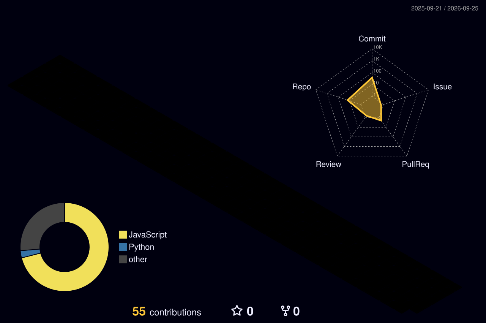

  
  
  
  
  

---

## Who I Am

Full Stack Engineer at **Codegnan IT Solutions** with **1.5+ years** shipping production MERN apps — from MongoDB schema and REST APIs to React UI and release.

I don't just contribute features. I **own systems end-to-end**: auth, permissions, notifications, dashboards, and cross-service integration.

| Signal | Proof |
|---|---|
| Delivery | **240+ merged PRs** across **10 repositories** |
| Live products | **2 platforms** used daily by teams and students |
| Ownership | JWT auth, RBAC, mailer pipelines, LMS ↔ placements |

---

## Live Products

| Product | What it does | Stack | Status |
|---|---|---|---|
| **[Corporate Relations](https://corporaterelations.codegnan.ai/)** | Placements platform — jobs, eligibility, applications, manager approvals, email/WhatsApp notifications | React · Node · MongoDB · JWT · SSE | `LIVE` |
| **[Codegnan Edge LMS](https://codegnanedge.com/)** | Learning portal — student dashboards, live support, course flows | React · Express · MongoDB · Redux | `LIVE` |
| **[suryadeals.com](https://suryadeals.com)** | Personal site — self-hosted on Oracle Cloud + Nginx + SSL | Next.js · OCI · Nginx | `LIVE` |

---

## Skills & Tools

  

 

**Core strengths:** REST API design · JWT + refresh (httpOnly) · Role/permission guards · MongoDB modeling · React dashboards · Background jobs · System integration

---

## GitHub Analytics

  
  
  

 

  

---

## Contribution Snake

<picture>
  <source media="(prefers-color-scheme: dark)" srcset="https://raw.githubusercontent.com/somanisuryateja/somanisuryateja/output/github-contribution-grid-snake-dark.svg"/>
  <source media="(prefers-color-scheme: light)" srcset="https://raw.githubusercontent.com/somanisuryateja/somanisuryateja/output/github-contribution-grid-snake.svg"/>
  
</picture>

---

## Activity + 3D Contributions

  
    
  

---

## Let's Build

**Open to Full Stack / Software Engineer roles · Hyderabad · Remote-friendly**

[LinkedIn](https://www.linkedin.com/in/somanisuryateja) · [Portfolio](https://suryadeals.com) · [Email](mailto:surya76755416@gmail.com) · +91 7675050247

